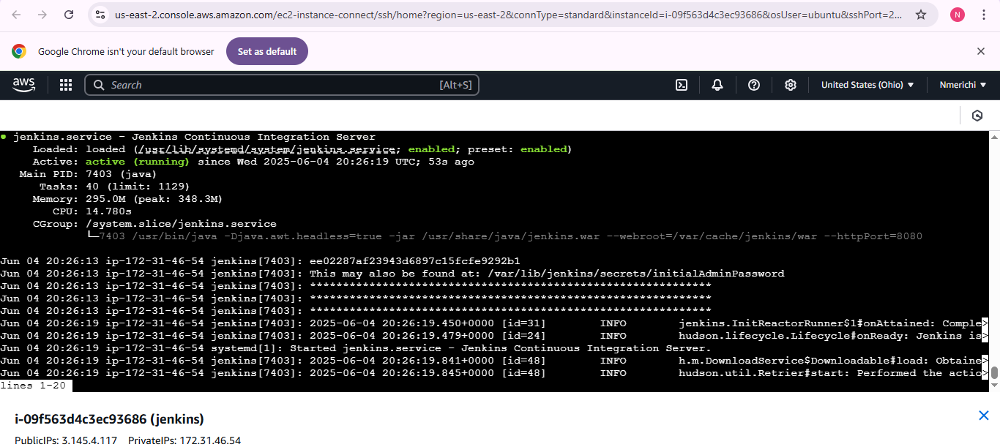
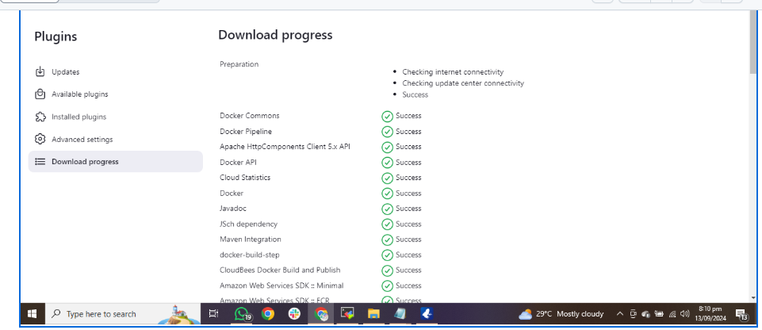
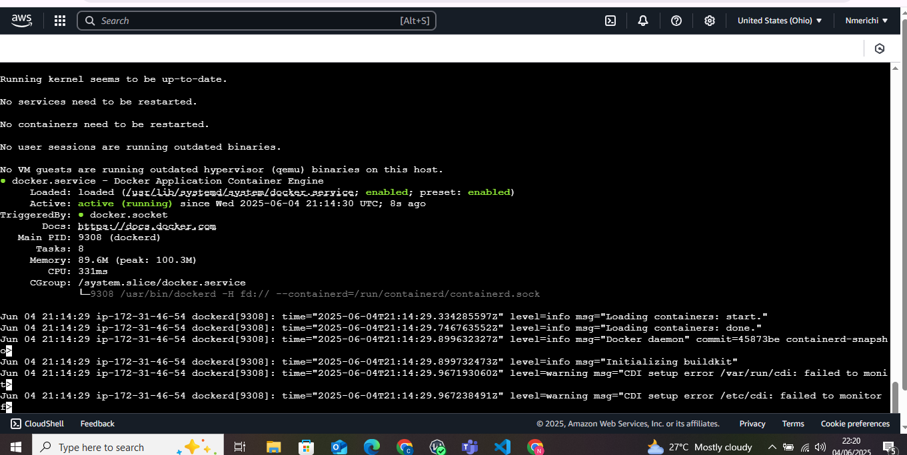
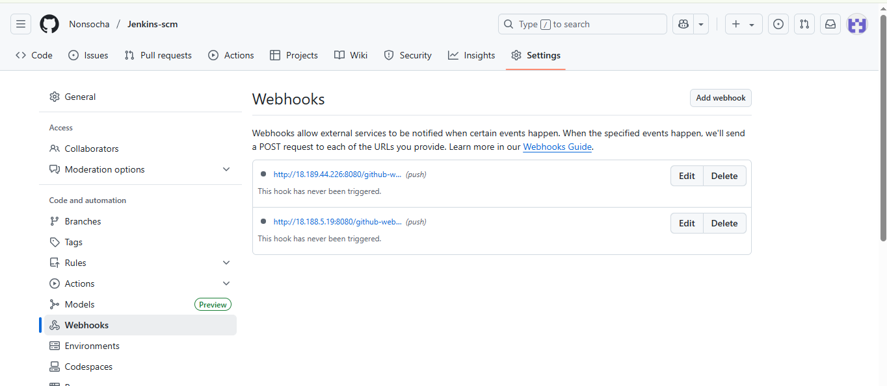
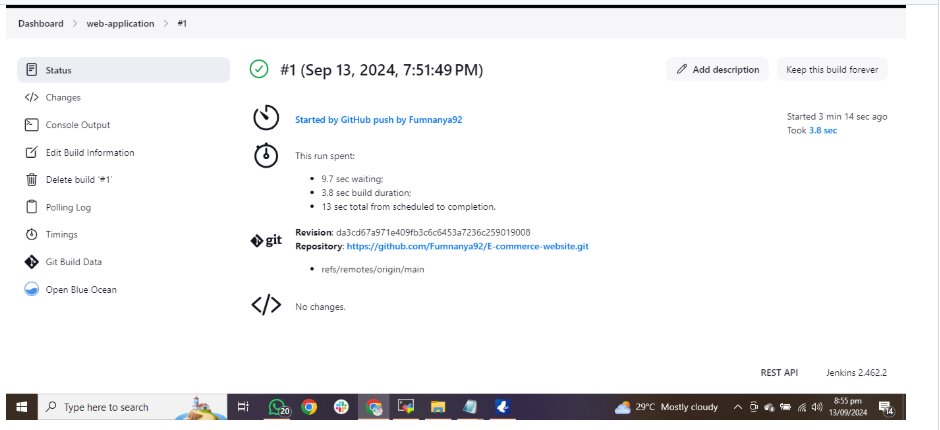
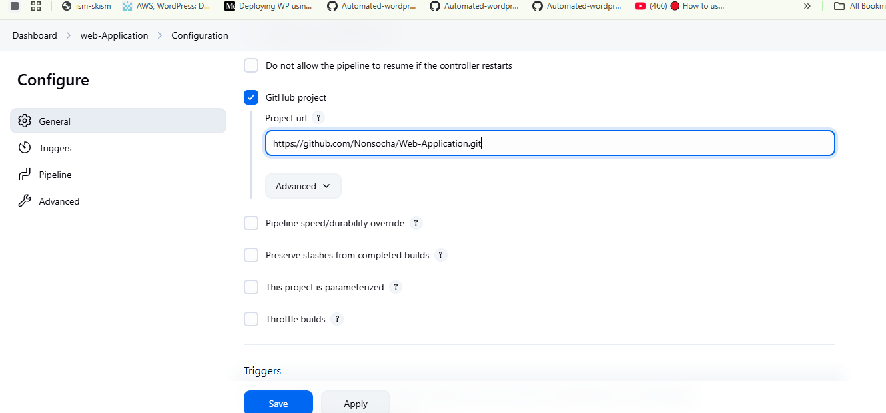
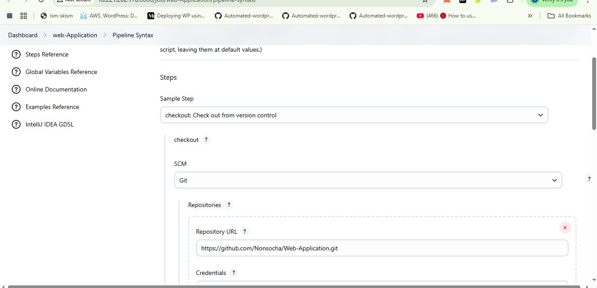
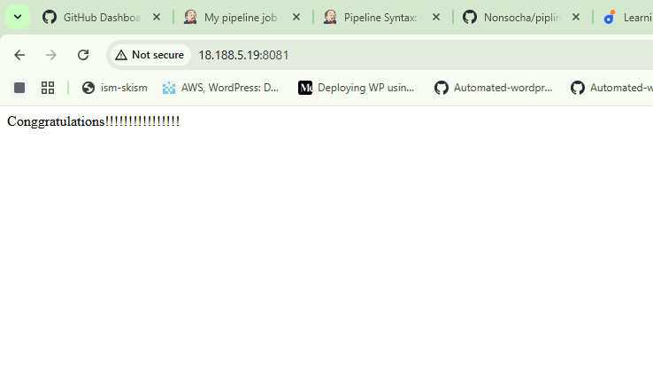

# Automating Deployment of E-commerce Website: CI/CD Mastery

# Project Scenario

 A technology consulting firm is migrating to cloud architecture. My task as a DevOps Engineer is to design and implement a CI/CD pipeline using *Jenkins* to automate the deployment of an e-commerce web application. This pipeline will handle *continuous integration (CI)* and *continuous deployment (CD)*, ensuring scalability and reliability.

 ## Pre-requisites
 * **Knowledge of Jenkins essentials**
 * completion of:
   
   * introduction to jenkins
   * Jenkins Freestyle Project
   * Jenkins Pipeline Job mini projects  
 # Project Deliverable
  1. **Documentation:**
    
     * Detailed setup of Jenkins components
     * Security measures at every stage
  2. **Demonstration:**
     
     * Live demo of the complete CI/CD pipeline.
  ##  Project Components
  
1. **Jenkins Server Setup**
   
   **Objective:**

    Configure a Jenkins server to automate the CI/CD pipeline.

**Steps:** 
1. **Install Java (Jenkins requires Java 11 or 17)**

   ```
    sudo apt update
    sudo apt install openjdk-17-jdk -y
   ```
2. **Check java version**

    ```
    java -version
    ```
3. **Add the Jenkins Repository Key**    
    ```
    curl -fsSL https://pkg.jenkins.io/debian-stable/jenkins.io-2023.key | sudo tee \
    /usr/share/keyrings/jenkins-keyring.asc > /dev/null
    ```
 4. **Add the Jenkins Repository to Your System**
    ```
    echo "deb [signed-by=/usr/share/keyrings/jenkins-keyring.asc] \
    https://pkg.jenkins.io/debian-stable binary/" | sudo tee \
    /etc/apt/sources.list.d/jenkins.list > /dev/null
    ```
 5. **Update Package List**
    ```
     sudo apt update
    ```
6. **Install Jenkins**
 
     ```
       sudo apt install jenkins
      ```
8. **Start and Enable Jenkins**     
     ```
     sudo systemctl start jenkins
     sudo systemctl enable jenkins
     ```
   **Verify Jenkins Status**
      ```    
       sudo systemctl status jenkins 
      ```
      

 **Access Jenkins via Browser**

 ```
     http://<your_server_ip>:8080
```

* **Unlock Jenkins:** The initial admin password is located in /var/lib/jenkins/secrets/initialAdminPassword.

**1.2 Set Up Necessary Plugins**
   * After logging into Jenkins, install the following essential plugins:

     * **Git plugin:** Enables Git integration for pulling code.
     * **Docker plugin:** Allows Jenkins to run Docker containers for builds and deployments.
     * **Blue Ocean Plugin:** enriches your website building experience by adding extra features to the OceanWP free theme.

 ```
  # Navigate to "Manage Jenkins" > "Manage Plugins" >  "Available Plugins"
  # Install Git, Docker Pipeline, Pipeline plugins,  Blue Ocean Plugins
```


**1.3 Installing Docker to the machine**
* ``vim`` into docker.sh and paste the file below
  
  ```
  sudo apt-get update -y
  sudo apt-get install ca-certificates curl gnupg
  sudo install -m 0755 -d /etc/apt/keyrings
  curl -fsSL https://download.docker.com/linux/ubuntu/gpg | sudo gpg --dearmor -o /etc/apt/keyrings/docker.gpg
  sudo chmod a+r /etc/apt/keyrings/docker.gpg

  #Add the repository to Apt sources:
  echo \
  "deb [arch=$(dpkg --print-architecture) signed-by=/etc/apt/keyrings/docker.gpg] https://download.docker.com/linux/ubuntu \
  $(. /etc/os-release && echo "$VERSION_CODENAME") stable" | \
  sudo tee /etc/apt/sources.list.d/docker.list > /dev/null
  sudo apt-get update -y
  sudo apt-get install docker-ce docker-ce-cli containerd.io docker-buildx-plugin docker-compose-plugin -y
  sudo systemctl status docker
  ```
* Make the file executable
  ```
  chmod +x docker.sh
  ```
*  Run the file to install docker
    ```
    ./docker.sh
   ```

      
 **1.4 Creating a dockerfile**
 **Steps**
1. Create a new file dockerfile
2. Copy the bellow script into the file and save

```
# Use the official NGINX base image
FROM nginx:latest

# Set the working directory in the container
WORKDIR  /usr/share/nginx/html/

# Copy the local HTML file to the NGINX default public directory
COPY index.html /usr/share/nginx/html/

# Expose port 80 to allow external access
EXPOSE 80
```

**1.5 Create your web application(index.html) in the same directory.**

**2. Source Code Management Repository Integration**
**2.1 Integrate Jenkins with GitHub**
* Go to Manage Jenkins > Configure System.
* Scroll down to GitHub section and add your GitHub credentials (username, password, or access token).
**2.2 Configure Webhooks for Automatic Triggering of Jenkins Builds**

* Webhook Setup on GitHub:
  * Go to the GitHub repository.
  * Click Settings > Webhooks > Add webhook.
  *  Set the Payload URL to http://``<jenkins-server-ip>:8080/github-webhook/``.
  *  set the Content type to application/json
  *   Choose Just the push event to trigger builds on every commit. Save


**3.Jenkins Freestyle Jobs for Build and Unit Tests**
**Objective:**
**To create Jenkins Freestyle jobs for building the web application and running unit tests.**

**Steps:**
**3.1 Set Up a Freestyle Job for Building the Application**
  1. Navigate to **New Item** > **Freestyle Project.**

  **2. Source Code Management:** Select Git and enter the repository URL.

  **3. Branches to build:** change this to */main

  **4.Build Trigger:** Select GitHub hook trigger for GITScm polling.

* Save.


**4. Jenkins Pipeline for Web Application**
**Objective:**
  To develop a Jenkins Pipeline for running the e-commerce web application

**Steps:**
**4.1 Create a Jenkins Pipeline Script to Run the Application**
* Go to New Item > Pipeline.


**2. Pipeline Definition:** Choose Pipeline script from SCM and provide the GitHub repository URL.

**3.Pipeline Script Example:**
```
pipeline {
    agent any

    stages {
        stage('Connect To Github') {
            steps {
                    checkout scmGit(branches: [[name: '*/main']], extensions: [], userRemoteConfigs: [[url: 'https://github.com/Nonsocha/Jenkins-scm.git']])
            }
        }
        stage('Build Docker Image') {
            steps {
                script {
                    sh 'docker build -t dockerfile .'
                }
            }
        }
        stage('Run Docker Container') {
            steps {
                script {
                    sh 'docker run -itd -p 8081:80 dockerfile'
                }
            }
        }
    }
}
```
* **Checkout Stage:** Pulls the latest code from the repository.
* **Build Stage:** Builds the application (dockerfile).
* **Test Stage:** Runs unit tests to ensure code stability. - this stage is not in the above script
* **Deploy Stage:** Executes deployment logic (e.g., Docker container or Kubernetes deployment).
To get a custom syntax to connect Git to jenkins click pipeline syntax
* **Steps Select checkout:** Check out from version control input the git repo URL, credentials, and branch */main Generate Pipeline script

**To access your web browser we must ensure that our security group supports our port: 8081**


**We can now access our web application here**
``http://jenkins-ip-address:8081``

